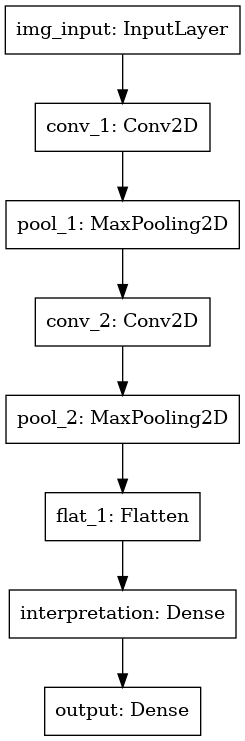

# Predicting Genre From Audio Signal

## Contents:
- [Problem Statement](#Problem-Statement)
- [Executive Summary](#Executive-Summary)
- [Limitations](#Limitations)
- [Data Description](#Data-Description)
- [Modeling](#Modeling)
- [Current and Next Steps](#Current-and-Next-Steps)

## Problem Statement
This project aims to predict the genre of a song based on audio signal data in order to better understand what features account for human perception of sound. It will serve as a foundation for future machine learning models that can make predictions on how a human might be percieving an audio signal.

## Executive Summary
I began by using classical machine learning models to predict genre using the precomputed audio feature statistics provided in the free music archive. Of these audio features the mel frequency cepstral coefficients (mfccs) provided the highest level of accuracy when predicting genre. The best performing model was logistic regression. Performing logistic regression on the mfccs yielded an accuracy of 52.2% which is a large improvement over the baseline of 12.5%. Based on these results I began to build neural networks using the mfccs to predict genre. Currently my highest performing model is a convolutional neural network that is trained on images of the mfcc spectrograms of the songs. These spectrograms were generated using the librosa library. This neural network in it's current state is only ~35% accurate on unseen data. I am working on tuning it and also creating a multiinput neural network.

## Limitations
The biggest limitation for this project is that genre is a subjective concept. Two people can listen to the same song and disagree on what it's genre is. This means that any machine learning models I build will inheret the perceptions of genre of whoever encoded the data I work with. With this particular data the genre for each track was encoded by the artists themselves. 

## Data Description
### Precomputed Data
Data was pulled from the [free music archive](https://github.com/mdeff/fma) github. For the audio files I pulled the 'small' subset and worked with that. This dataset came with summary statistics on audio features that were created by the authors of the free music archive.

- **Audio Features**
  - chroma energy normalized chroma
  - constant q transform chroma
  - short time fourier transform chroma
  - mel frequency cepstral coefficients
  - root mean squared energy
  - spectral bandwidth
  - spectral centroids
  - spectral rolloff
  - tonnetz
  - zero crossing rate

For each of these audio features the following statistics were provided

- **Statistics**
  - kurtosis
  - maximum value
  - mean
  - median
  - minimum value
  - skew
  - standard deviation
 

### Feature Extraction from mp3 Files
Because the mfccs gave the highest accuracy I decided to focus on extracting these first from the mp3 files. I extracted them both as they come from the librosa method and as a .png file with pixel values. Genre was taken from the metadata that was provided.

## Modeling
First models were trained using all 518 feature statistics provided. The baseline accuracy is 12.5%

|Model|Random Forest|Gradient Boost|ADA Boost|Logistic Regression|KNN|
|:---:|:---:|:---:|:---:|:---:|:---:|
|Test Score|42.4%|48.2%|42.3%|57.7%|46.8%|
|Train Score|44.8%|54.5%|44.0%|66.6%|65.1%|

Logistic regression was the most promising at this stage. I began to model based on the statistics of one audio feature at a time. Logistic regression on the mfcc statistics yielded the highest accuracy with the least overfitting. The testing accuracy was 57.7% and the training accuracy was 66.6%. Based on these results I extracted the mfccs from the audio data I had and built a convolutional neural network which was trained on them. The mfccs were visualized as spectrograms and saved as .png files. The neural network that performed the best was a convolutional neural network with the following architecture.

Though this model is the best of the neural networks I have so far it is far less accurate than the logistic regression with an accuracy only in the mid 30's on both training and testing data.

## Current and Next Steps
- Current Focus
  - Tweak architecture of sequential neural network to improve accuracy
  - build multi input neural network

- Future Steps
  - Use unsupervised learning to cluster songs rather than rely on genres provided
